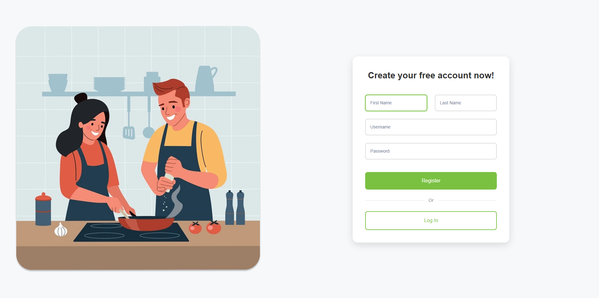

# TasteBuds - Cooking Social Media Recipe App

TasteBuds is a social media platform for food enthusiasts to share, discover, and interact with recipes. Users can post recipes, like and comment on posts, and search for recipes or users.

## ✨ Features
- **Dynamic Feed**: View posts from users you follow.
- **Recipe Upload**: Upload recipes with images, descriptions, and ingredients.
- **Search**: Search for recipes or users.
- **Authentication**: Secure login and signup.
- **Filters**: Sort recipes by cuisine type or dietary preferences.

## 🛠️ Technologies
- **Frontend**: React, Vite, Chakra UI
- **Backend**: Python (Django), Django REST Framework
- **Database**: SQLite (development)
- **Authentication**: JWT (JSON Web Tokens)
- **Version Control**: Git, GitHub

## 📱 App Screenshots

Here's a visual tour of our application:

### Start Page
<div>
  
</div>

*The welcome page introduces users to TasteBuds with a clean, inviting interface.*

### Authentication
<div>
  
  
</div>

*Secure authentication with a clean, user-friendly interface and detailed error handling.*

### Home Feed
<div>
  
</div>

*The home feed displays recipes from users you follow, with options to like, comment, and save.*

### User Profile
<div>
  
</div>

*User profiles showcase a user's posted recipes, bio, and followers/following counts.*

### Recipe Creation
<div>
  
</div>

*The recipe creation page allows users to upload images, ingredients, and step-by-step instructions.*

### Search & Discovery
!<div>
  
</div>

*Search for recipes or users with our powerful search and filtering capabilities.*

### Explore
<div>
  
</div>

*Discover trending and popular recipes from around the community.*

## 🚀 Setup Instructions

### Prerequisites
- Node.js (v16 or higher)
- Python (v3.8 or higher)
- PostgreSQL or MongoDB

### Setting up the App
1. Clone the repository:

   ```bash
   git clone https://github.com/jamesjb21/CS35L-group-project.git
   cd CS35L-group-project
   ```

2. Create a virtual environment:

   ```bash
   python -m venv <environment_name>
   source <environment_name>/bin/activate *for linux/macos
   <environment_name>\Scripts\activate *for windows

   deactivate *deactivate environment
   
3. Install backend packages:

   ```bash
   cd backend
   pip install -U -r requirements.txt
   
4. Start the backend server:

   ```bash
   python manage.py makemigrations
   python manage.py migrate
   python manage.py runserver
   ```

5. Install frontend packages:

   ```bash
   cd ..
   cd frontend
   npm install
   ```   

6. Start the frontend:

   ```bash
   npm run dev
   ```
